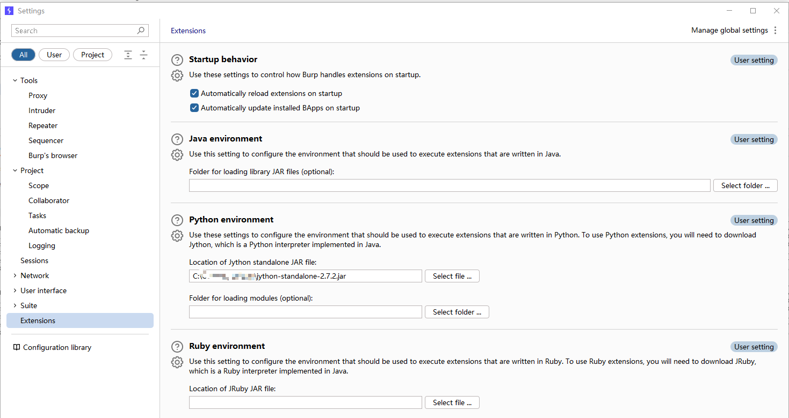
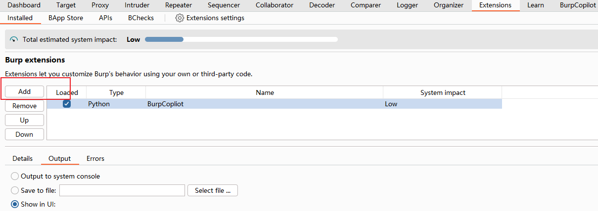
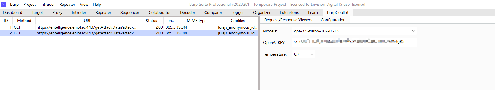
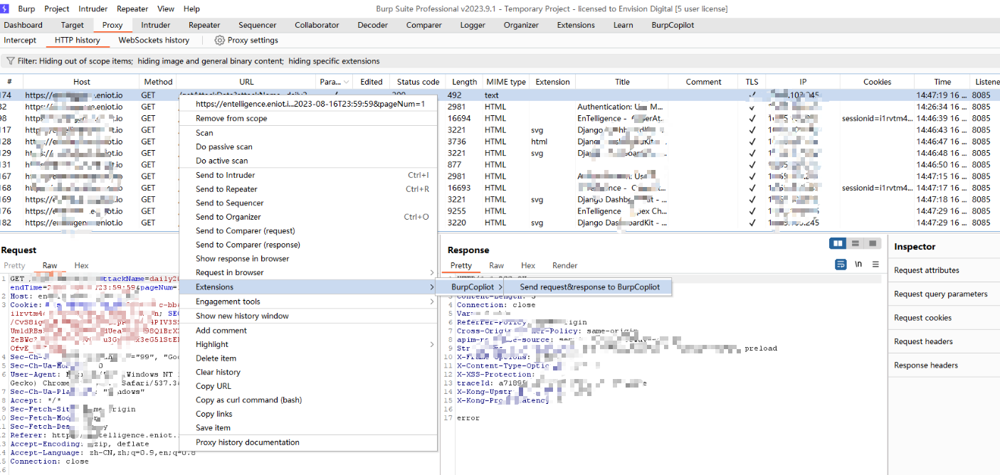
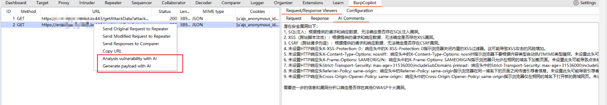
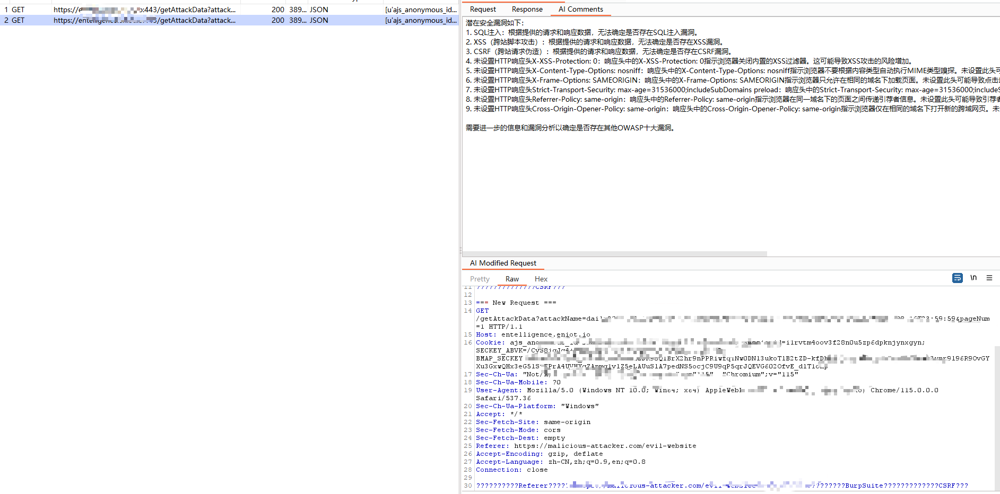
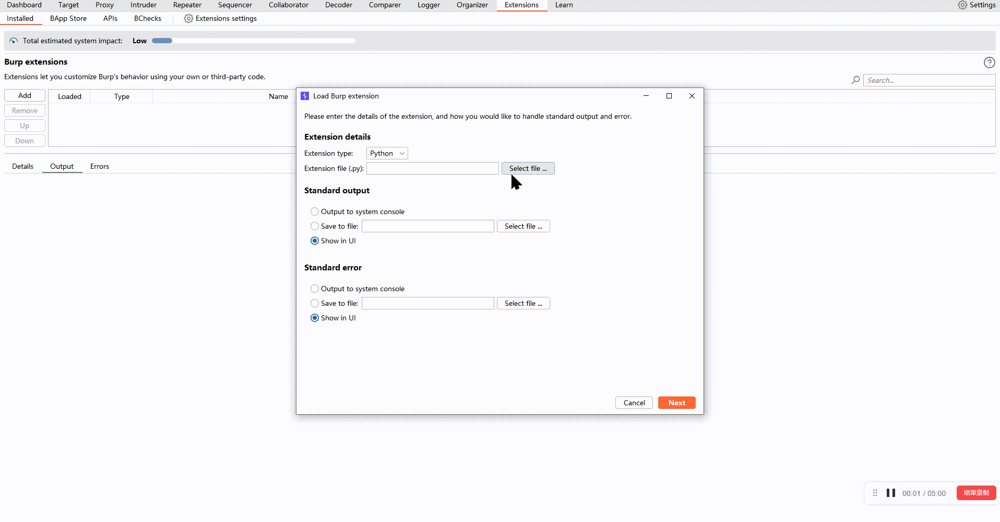

# 基于AI的Web漏洞检测器用于Burp Suite

## 概述

此Burp Suite扩展利用人工智能（AI）的力量分析应用程序流量中的HTTP请求和响应。通过使用尖端的机器学习模型和算法，自动识别潜在的Web漏洞，为安全分析师和测试人员提供改善安全状况的见解。

## 特点

- **AI驱动分析**：利用先进的AI技术识别可能被传统工具忽视的复杂漏洞。
- **与Burp Suite集成**：无缝集成到Burp Suite环境中，允许用户在熟悉的界面中工作。
- **可定制扫描**：使用户能够配置AI模型以适应他们的特定要求和威胁景观。
- **实时反馈**：提供有关流量内潜在漏洞的即时反馈，加快识别过程。
- **详细报告**：生成突出显示检测到的漏洞的综合报告，完整的补救建议。

## 安装和使用

1. 下载扩展的最新版本。
2. 点击“添加”并选择下载的JAR文件。

3. 打开Burp Suite并导航到“Extender”选项卡。

4. 在扩展的选项卡内配置任何必要的设置，例如AI模型选择或特定扫描参数。

5. 在HTTP历史选项卡中，选择一个请求记录，右键单击扩展-> BurpCopilot-> 发送请求和响应到BurpCopilot，您将能够在BurpCopilot页面上看到此记录。

6. 右键单击所选记录，然后点击'使用AI分析漏洞，然后在AI评论视图上显示ai回复。

6. 右键单击所选记录，然后点击'用AI生成有效载荷，然后用AI生成新请求和有效载荷。

录制视频

## 要求

- Burp Suite Professional
- Java运行时环境（JRE）8或更高版本

## 支持和贡献

如有错误，增强请求或其他查询，请随时提出问题。欢迎通过拉取请求向代码库做出贡献。

## 许可证

[如适用，许可证信息]

## 免责声明

此工具仅供教育和研究目的使用。确保在扫描任何系统之前获得适当的授权。
