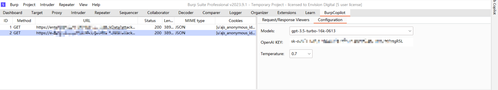

Certainly! Here's the README in Markdown format:

```markdown
# AI-based Web Vulnerability Detector for Burp Suite

## Overview

This extension for Burp Suite utilizes the power of Artificial Intelligence (AI) to analyze HTTP requests and responses within the application's traffic. By employing cutting-edge machine learning models and algorithms, it automates the identification of potential web vulnerabilities, providing security analysts and testers with insights to improve their security posture.

## Features

- **AI-powered Analysis**: Leverages advanced AI techniques to identify complex vulnerabilities that might be overlooked by traditional tools.
- **Integration with Burp Suite**: Seamlessly integrates into the Burp Suite environment, allowing users to work within a familiar interface.
- **Customizable Scans**: Enables users to configure the AI models to fit their specific requirements and threat landscape.
- **Real-time Feedback**: Provides immediate feedback on potential vulnerabilities within the traffic, speeding up the identification process.
- **Detailed Reporting**: Generates comprehensive reports highlighting detected vulnerabilities, complete with remediation recommendations.

## Installation

1. Download the latest release of the extension.
2. Click on "Add" and select the downloaded JAR file.
<div align="center">

</div>
3. Open Burp Suite and navigate to the "Extender" tab.
<div align="center">

</div>
4. Configure any necessary settings within the extension's tab, such as the AI model selection or specific scanning parameters.
<div align="center">

</div>
5. In the HTTP History Tab, select a Request record, right-click on Extensions -> BurpCopilot -> Send request & response to BurpCopilot, and you will be able to see this record in the BurpCopilot page.
<div align="center">

</div>
6. Right-click on a selected record and click 'Analysis vulnerability with AI, then show ai replies on AI Comments view.
<div align="center">

</div>
6. Right-click on a selected record and click 'Generate payload with AI, then generate new request with payloads by AI
<div align="center">

</div>

Record Video
<div align="center">

</div>

## Usage

1. Navigate to the extension's tab within Burp Suite.
2. Start your scanning task or manually send requests/responses to the AI engine.
3. Review the detected vulnerabilities and insights provided by the extension.
4. Apply recommended fixes and test again to ensure vulnerabilities are mitigated.

## Requirements

- Burp Suite Professional
- Java Runtime Environment (JRE) 8 or higher

## Support & Contribution

Feel free to open issues for bugs, enhancement requests, or other inquiries. Contributions to the codebase are welcome through pull requests.

## License

[License information if applicable]

## Disclaimer

This tool is provided for educational and research purposes only. Ensure that you have proper authorization before scanning any systems.
```

You can copy and paste this directly into a README.md file in your project repository, and it will render properly on platforms like GitHub.